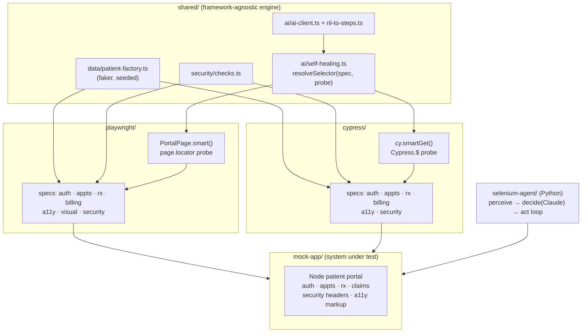

# healthcare-qa-intelligence

End-to-end test automation for healthcare patient-portal workflows, implemented in **both
Playwright and Cypress** from a shared, framework-agnostic engine — with self-healing
locators, accessibility/visual/security gates, synthetic test data, and an autonomous
Selenium agent.

[](https://github.com/qaintelligence/healthcare-qa-intelligence/actions/workflows/ci.yml)


> Targets a **bundled synthetic mock portal** by default, so `npm install && npm run e2e` is
> green for anyone with no accounts and no real patient data. See
> [ADR 0001](docs/adr/0001-bundled-mock-as-system-under-test.md) for why.

## Why I built this

I spend my day building Cypress/TypeScript automation for a healthcare portal, and I kept
wanting a place to work out the *engineering* side of test automation in the open — not "look,
the tests pass," but the parts that actually decide whether a suite survives a year: stable
selectors, real parallel isolation, web-first waits, and CI you trust.

Healthcare felt like the right domain because the failure modes are concrete — booking the
wrong slot, fumbling a refill, leaking an identifier into a URL. I obviously can't point a
suite at a real patient portal (unauthorized, and impossible for anyone else to reproduce), so
I wrote a small mock portal I own and test against that. The mock is throwaway; the framework,
the decisions, and the bugs I had to fix are the point — those are written up in the
[ADRs](docs/adr) and the [changelog](CHANGELOG.md).

## Modeled workflows

| Workflow | Coverage |
|---|---|
| Login / session | valid + invalid creds, protected-route redirects, logout |
| Appointment scheduling | booking with synthetic data, required-field validation |
| Prescription refills | request refill, status update, zero-refills guard |
| Insurance claims & billing | submit claim, processing status, seeded-state checks |

Cross-cutting on every screen: **accessibility** (axe-core, WCAG 2.1 AA), **visual
regression**, and a **security baseline** (headers, cookie hardening, no-PHI-in-URL,
anti-enumeration, access control).

|  |  |
|---|---|
|  |  |

## Architecture

One framework-agnostic engine in `shared/`, bound to each runner through a thin adapter
([ADR 0002](docs/adr/0002-two-runners-one-shared-engine.md)). Write the logic once; run it in
both Playwright and Cypress.



## Key engineering decisions

The non-obvious choices, with full context and rejected alternatives in
[`docs/adr/`](docs/adr):

| Decision | Tradeoff accepted |
|---|---|
| [Bundled mock as the SUT](docs/adr/0001-bundled-mock-as-system-under-test.md) | Runnable + safe, but not proof of testing a complex production app |
| [Two runners, one engine](docs/adr/0002-two-runners-one-shared-engine.md) | More indirection, but no duplicated logic and broader coverage |
| [Self-heal on existence, not visibility](docs/adr/0003-self-healing-resolves-on-existence.md) | `smart()` returns possibly-hidden elements; caller asserts visibility (fixed a real race) |
| [AI optional, degrades gracefully](docs/adr/0004-ai-features-degrade-gracefully.md) | Full AI only visible with a key, but CI stays deterministic and free |
| [Entity-scoped assertions](docs/adr/0005-test-isolation-via-entity-scoped-assertions.md) | Discipline required, but parallel-safe on shared mock state |
| [Agent same-origin + step cap](docs/adr/0006-agent-safety-guards.md) | Blocks cross-domain flows, but the agent can't wander or loop forever |

See also: **[Test strategy](docs/test-strategy.md)** · **[Known limitations](docs/known-limitations.md)** · **[Roadmap](ROADMAP.md)** · **[Changelog](CHANGELOG.md)** (incl. the real bugs fixed while building this).

## Quick start

```bash
npm install
npx playwright install        # browsers (first time)
npm run e2e                   # Playwright + Cypress (auto-boots the mock app)

# or individually:
npm run e2e:pw                # Playwright only
npm run e2e:cy                # Cypress only
npm run mock                  # just the mock portal at http://127.0.0.1:4300
npm run typecheck
```

Run in containers instead: `docker compose up --build --abort-on-container-exit`
(see [docs/deployment.md](docs/deployment.md)).

## AI features (and their honest scope)

All of these **degrade to deterministic behaviour without an `ANTHROPIC_API_KEY`**, so they
never make the build flaky ([ADR 0004](docs/adr/0004-ai-features-degrade-gracefully.md)):

- **Self-healing locators** — declare intent + ordered fallback selectors; drift is *healed
  and logged* instead of failing the suite. With a key, each heal also gets an AI-suggested
  durable selector. The login button uses a deliberately-stale primary selector so you can
  watch it heal. ([docs](docs/self-healing-locators.md))
- **Synthetic test data** — seeded faker factories; optional LLM-generated reason-for-visit.
- **NL-to-test authoring CLI** — `shared/ai/nl-to-steps.ts` turns a sentence into a test
  draft. *Deliberately a thin wrapper* — the value is the conventions it feeds the model
  (noted in [known limitations](docs/known-limitations.md)).

## Autonomous Selenium agent

[`selenium-agent/`](selenium-agent) is a Python agent that drives the browser via a
**perceive → decide → act** loop: it observes interactive elements, asks Claude for the next
action, executes it with Selenium, and repeats until the goal is met — with same-origin and
max-step guards ([ADR 0006](docs/adr/0006-agent-safety-guards.md)) and a heuristic fallback
that runs without a key.


*The agent autonomously logs in, navigates to prescriptions, and requests a refill — each
frame is a real step it decided and executed (recorded with `--record`).*

```bash
npm run mock &        # portal on :4300
cd selenium-agent && pip install -r requirements.txt
python agent.py "log in and request a prescription refill"
```

## Project layout

```
mock-app/        Dependency-free Node patient portal (system under test) + Dockerfile
shared/          AI engine, data factories, security checks — used by both suites
playwright/      Page objects (self-healing), fixtures, specs
cypress/         Custom commands (self-healing), specs
selenium-agent/  Autonomous Selenium AI agent loop (Python)
docs/            ADRs, test strategy, deployment, limitations, screenshots
.github/         CI (Playwright chromium/firefox/webkit + Cypress + typecheck) + templates
```

## Responsible use

Authorized testing only. Defaults to the bundled synthetic mock — no real PHI. Point
`BASE_URL` / the agent's `--url` only at systems you own or are authorized to test, never
production or third-party healthcare systems. See [SECURITY.md](SECURITY.md).

## How this was built (and the AI part)

I built this with AI assistance (mostly Claude) — and since AI-in-testing is half the point of
the project, hiding that would be silly. What I want to be clear about is the division of
labour, because that's the part that matters:

- **The decisions are mine.** Why the mock app is the system under test, why self-healing
  resolves on existence instead of visibility, why assertions are entity-scoped for parallel
  safety — those are judgment calls, written up in the [ADRs](docs/adr) with the alternatives
  I rejected.
- **The bugs were real.** Getting the suite green wasn't one prompt. The
  [changelog](CHANGELOG.md) lists the actual failures I hit and root-caused — a visibility-race
  in the locator engine, a Cypress `.should()`-callback misuse, OS-specific visual baselines
  breaking CI. AI helped me write the fixes; figuring out *what* was wrong was the work.
- **I can explain and extend any of it.** That's the real test, and it's why the docs read the
  way they do — they're as much my notes as they are documentation.

If you're evaluating this: read an ADR and the changelog before the test files. They show the
thinking, which is the thing AI doesn't do for you.

### What I'd change with more time

- Add a unit layer under `shared/` (the engine is only exercised end-to-end today).
- Swap the mock's in-memory state for per-worker isolation so I can assert on counts again.
- Wire a visual-diff service (Argos/Percy) instead of committed per-OS baselines.

These and the rest are tracked as real [issues](../../issues) and on the [roadmap](ROADMAP.md).

## License

[MIT](LICENSE)
